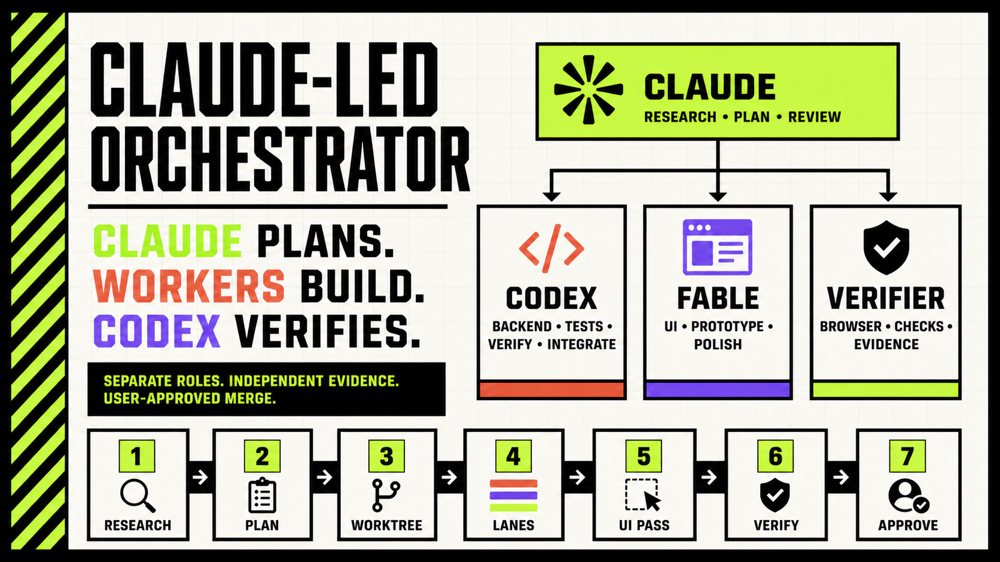
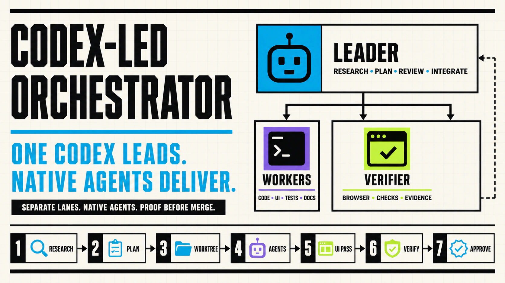

# Orchestrate Skills for Claude Code and Codex

**One leader plans. Dedicated workers build. An independent verifier checks.**

This repository contains two worktree-based orchestration skills:

| Skill | Leader | Workers | Source |
| --- | --- | --- | --- |
| Claude-led | Claude/Fable | Codex for research, implementation, verification, and integration; Fable for UI | [`skills/orchestrate/SKILL.md`](skills/orchestrate/SKILL.md) |
| Codex-led | Codex | Native Codex subagents for every lane | [`.codex/skills/orchestrate/SKILL.md`](.codex/skills/orchestrate/SKILL.md) |

Both variants keep planning, implementation, verification, and integration as
separate responsibilities. They use dedicated branches and worktrees, track
lane ownership explicitly, require evidence for completion, and wait for user
approval before merging.

The repository name is retained for compatibility with existing Claude Code
plugin installs. The Codex skill is distributed as a standalone file in the
same repository.

## Claude-led flow



## Codex-led flow



## Install

### Claude Code: copy into a repository

```bash
mkdir -p .claude/skills/orchestrate
curl -L \
  https://raw.githubusercontent.com/danielrahman/claude-orchestrate-skill/main/skills/orchestrate/SKILL.md \
  -o .claude/skills/orchestrate/SKILL.md
```

Then run:

```text
/orchestrate
```

### Claude Code: install as a plugin

```text
/plugin marketplace add danielrahman/claude-orchestrate-skill
/plugin install claude-orchestrate-skill@claude-orchestrate-skill
```

The installed command may be namespaced by your Claude Code setup. Use the
command name shown by `plugin details`.

### Codex: copy into a repository

```bash
mkdir -p .codex/skills/orchestrate
curl -L \
  https://raw.githubusercontent.com/danielrahman/claude-orchestrate-skill/main/.codex/skills/orchestrate/SKILL.md \
  -o .codex/skills/orchestrate/SKILL.md
```

Restart or reopen the Codex task if the new skill is not discovered
immediately, then ask Codex to use `/orchestrate`.

## What changed in the current version

- Adds a native Codex-led orchestration skill.
- Pins worker model and reasoning effort explicitly instead of relying on
  inherited defaults.
- Adds cross-model plan review for multi-lane Claude-led work.
- Requires the full plan to be visible before an approval question.
- Tracks worker ownership, status, and final payloads in a parent-side ledger.
- Records deviations and assumptions in uncommitted implementation notes.
- Adds an optional three-variant prototype phase for new or redesigned UI.
- Adds an ordered UI refinement and skill-polish pass.
- Prefers the Codex app Browser integration for visual verification, with one
  retry and an explicit fallback when the in-app browser session is broken.
- Keeps commits focused and makes merge, push, and deploy user-controlled.

## Shared workflow

1. Read repository instructions, source-of-truth docs, and relevant code.
2. Split work into non-overlapping lanes with owned files and acceptance
   criteria.
3. Review larger plans independently and show the complete plan to the user.
4. Create a dedicated branch and worktree for the slice.
5. Dispatch self-contained worker briefs and keep a parent-side lane ledger.
6. Run UI prototype and refinement passes when the task is browser-visible.
7. Verify independently with tests, browser checks, screenshots, and the diff.
8. Send failed gates back to the owning lane.
9. Commit only verified files and merge only after explicit approval.

## Requirements and assumptions

The skills do not install their dependencies.

- The Claude-led variant expects Claude Code worker tooling and an authenticated
  Codex CLI for Codex lanes.
- The Codex-led variant expects native Codex subagent tools.
- Both variants expect Git worktrees and repository-specific setup/check
  commands supplied by the target project.
- Browser-visible tasks need a working browser integration or a named fallback
  such as Playwright.
- The optional UI polish pass references `/adapt`, `/typecraft-guide`,
  `/web-animation-design`, and `/web-design-guidelines`. Install or replace
  those skills explicitly in your environment.

The model names in the skills are tested defaults, not silent fallbacks. If a
named model is unavailable, choose the nearest explicit replacement and report
the substitution before dispatch.

## Hard rules

- One worker owns one lane; parallel lanes never share files.
- The worker that wrote a change does not verify it.
- Worker claims are not evidence. Diffs, command output, screenshots, and
  persisted behavior are evidence.
- Secrets, implementation notes, prototype routes, and temporary screenshots
  are never committed.
- No merge, push, deploy, rebase, or force-push happens without the authority
  required by the user's request.

## Good fit

Use orchestration for multi-file features, risky refactors, browser-visible UI,
security or data-sensitive work, or any change that benefits from independent
verification and a clean worktree boundary.

Skip it for tiny fixes, read-only reviews, product questions that still need
shaping, or work that must remain in the current dirty checkout.

## Repository layout

```text
skills/orchestrate/SKILL.md        Claude-led skill and plugin command
.codex/skills/orchestrate/SKILL.md Codex-led skill
.claude-plugin/                    Claude Code plugin metadata
docs/*-orchestrator-readme.webp     README flow cards
docs/orchestrate-twitter-card.png  Original Claude-led social preview
AGENTS.md                          contributor instructions
CLAUDE.md                          imports AGENTS.md
```

## License

MIT
