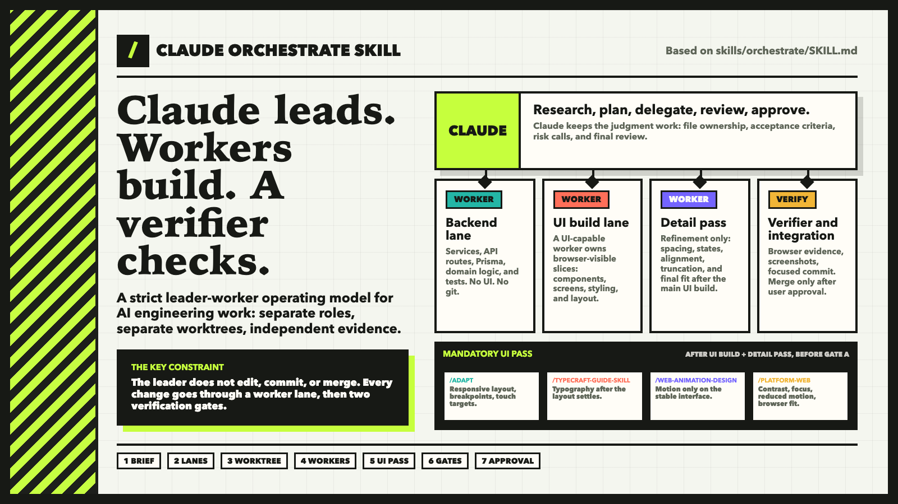

# Claude Orchestrate Skill

**Claude leads. Workers build. A separate verifier checks.**

A small Claude Code skill for work that should not be handled by one agent
editing and reviewing its own changes. `/orchestrate` gives Claude the leader
role: read the repo, split the task into worker lanes, keep the work in a
dedicated branch and worktree, require independent verification, and wait for
explicit approval before merge.

It is intentionally small. This repo ships one `/orchestrate` skill, Claude
Code plugin metadata, and a social preview image. It does not install Codex,
Opus, Composer, Cursor, browser tooling, or a global routing policy.



## Install

### Copy the skill into a repo

```bash
mkdir -p .claude/skills/orchestrate
curl -L \
  https://raw.githubusercontent.com/danielrahman/claude-orchestrate-skill/main/skills/orchestrate/SKILL.md \
  -o .claude/skills/orchestrate/SKILL.md
```

Then run:

```text
/orchestrate
```

### Install as a Claude Code plugin

If your Claude Code setup supports GitHub plugin marketplaces:

```text
/plugin marketplace add danielrahman/claude-orchestrate-skill
/plugin install claude-orchestrate-skill@claude-orchestrate-skill
```

The installed command may be namespaced by your Claude Code plugin setup. If so,
use the command name shown by `plugin details`.

## What it does

Use `/orchestrate` when a task needs delegation, a clean worktree boundary, or
independent verification. The skill makes the leader:

1. Read repo instructions, project docs, and relevant code first.
2. Split the task into lanes with non-overlapping file ownership.
3. Create a dedicated branch and worktree for the slice.
4. Dispatch workers with self-contained briefs.
5. Require an independent verifier for browser checks, tests, and screenshots.
6. Review the full diff after verification.
7. Send failed gates back to the owning worker.
8. Commit through an integration lane.
9. Merge only after explicit user approval.

## Hard rules

- Claude leads the work but does not edit files in orchestrated mode.
- One worker owns one lane.
- Parallel lanes do not touch the same files.
- The worker that wrote the change does not verify it.
- Code workers do not run git.
- Integration happens only after verification passes.
- Merges require explicit user approval.
- Screenshots, command output, and diffs are evidence. Worker claims are not.

## UI skill pass

For browser-visible UI changes, `/orchestrate` requires a final UI pass before
verification:

1. [`/adapt`](https://www.ui-skills.com/skills/pbakaus/adapt/) - responsive
   layout, breakpoints, touch targets, and fluid fit.
2. [`/typecraft-guide-skill`](https://github.com/ehmo/typecraft-guide-skill/blob/main/skills/typecraft-guide/SKILL.md) -
   typography after the responsive layout is settled.
3. [`/web-animation-design`](https://github.com/vercel-labs/open-agents/blob/main/.agents/skills/web-animation-design/SKILL.md) -
   motion and animation after the layout is stable.
4. [`/platform-web`](https://github.com/ehmo/platform-design-skills/blob/main/skills/web/SKILL.md) -
   final web design audit: contrast, focus states, reduced-motion behavior, and
   browser fit.

This pass runs after the primary UI build and detail refinement. Layout should
settle before typography, and motion should be added after the UI no longer
shifts.

`/platform-web` is the orchestration label for the
`web-design-guidelines` skill from
[ehmo/platform-design-skills](https://github.com/ehmo/platform-design-skills).

## Good fit

Use it for:

- multi-file implementation
- risky refactors
- UI work that needs independent browser verification
- permission, data, billing, or production-sensitive changes
- tasks that benefit from a clean worktree boundary
- work where Claude should remain the reviewer and coordinator

Skip it for:

- tiny one-line fixes
- product or design questions that still need shaping
- read-only reviews
- work that must happen directly in the current dirty checkout

## Repository layout

```text
skills/orchestrate/SKILL.md      the skill
.claude-plugin/                  plugin metadata
docs/orchestrate-twitter-card.png social preview
AGENTS.md                        contributor instructions
CLAUDE.md                        imports AGENTS.md
```

## Notes

The skill uses placeholders like `{worktree_root}`, `{slug}`, and
`{base_branch}` instead of machine-specific paths. Adapt them to your repo.

## License

MIT
